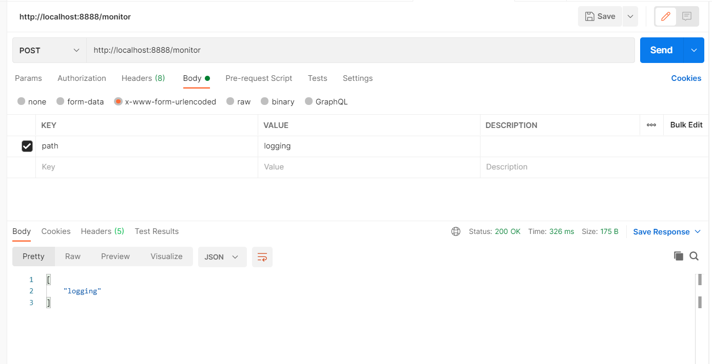

# Documentation
https://cloud.spring.io/spring-cloud-config/reference/html/#_quick_start

# Cloud config bus
https://medium.com/swlh/spring-cloud-config-bus-auto-refresh-properties-for-clients-d18fa4c036cb

# Trigger config change

```
"you can trigger a change notification by POSTing to /monitor with form-encoded body parameters in the pattern of path={name}. Doing so broadcasts to applications matching the {name} pattern (which can contain wildcards)."
```


https://cloud.spring.io/spring-cloud-config/multi/multi__push_notifications_and_spring_cloud_bus.html

# Profiles:
* To use config server by a file system backend use profile: `native`
* To use config server by a jdbc backend use profile: `jdbc`